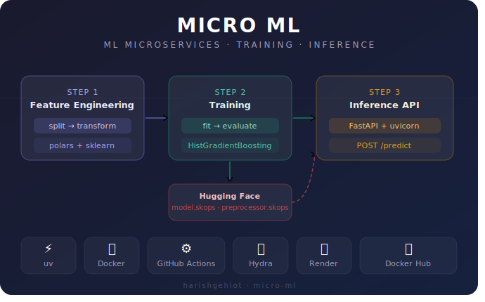

# 🧠 Micro ML



> A production-grade Machine Learning Classification microservice — from raw data to a live REST API.

---

## 🏗️ Architecture Overview

Micro ML follows a **microservices architecture** split across two independent services:

```
┌─────────────────────────────────┐       ┌──────────────────────────────────┐
│       Training Service          │       │        Inference Service          │
│  (Dockerfile.training)          │       │   (Dockerfile.inference)          │
│                                 │       │                                   │
│  ┌─────────────────────────┐    │       │   ┌────────────────────────────┐  │
│  │   Feature Engineering   │    │       │   │  Load model & preprocessor │  │
│  │  split → transform      │    │       │   │  from Hugging Face         │  │
│  └──────────┬──────────────┘    │       │   └────────────┬───────────────┘  │
│             ▼                   │       │                ▼                   │
│  ┌─────────────────────────┐    │       │   ┌────────────────────────────┐  │
│  │       Training          │    │       │   │     FastAPI REST API        │  │
│  │  fit → evaluate →       │───────────▶   │     POST /predict           │  │
│  │  upload to HF           │    │       │   │     GET  /health            │  │
│  └─────────────────────────┘    │       │   └────────────────────────────┘  │
└─────────────────────────────────┘       └──────────────────────────────────┘
         ↑ triggers on every push to main via GitHub Actions
```

---

## 🔄 CI/CD Pipeline

Every push to `main` automatically:

1. **Runs the training pipeline** (`uv run train`) — feature engineering, model fitting, evaluation
2. **Uploads model artifacts** (`model.skops`, `preprocessor.skops`) to Hugging Face
3. **Builds & pushes** both Docker images to Docker Hub (tagged `:latest` + `:<git-sha>`)
4. **Inference service** pulls fresh artifacts from Hugging Face on next startup

```
Push to main
     │
     ▼
 ┌────────┐     ┌──────────────────┐     ┌─────────────────────┐
 │  Test  │────▶│  uv run train    │────▶│  Upload to HF       │
 │  Job   │     │  (full pipeline) │     │  model.skops        │
 └────────┘     └──────────────────┘     │  preprocessor.skops │
                                         └─────────────────────┘
                                                   │
                                                   ▼
                                    ┌──────────────────────────┐
                                    │  Docker Job              │
                                    │  Build & push            │
                                    │  micro-ml-training       │
                                    │  micro-ml-inference      │
                                    └──────────────────────────┘
```

---

## 🛠️ Tech Stack

| Layer | Tool | Purpose |
|---|---|---|
| **Package & Env** | [`uv`](https://github.com/astral-sh/uv) | Fast dependency management |
| **Linting** | [`prek`](https://github.com/kashifulhaque/prek) | Rust-based pre-commit formatting |
| **Task Runner** | [`just`](https://github.com/casey/just) | Script orchestration & annotations |
| **Data** | [`polars`](https://pola.rs/) | High-performance DataFrames |
| **ML** | [`scikit-learn`](https://scikit-learn.org/) | Model training & preprocessing |
| **Config** | [`hydra-core`](https://hydra.cc/) + [`omegaconf`](https://omegaconf.readthedocs.io/) | Hierarchical configuration |
| **Serialization** | [`skops`](https://skops.readthedocs.io/) | Secure sklearn model persistence |
| **API** | [`FastAPI`](https://fastapi.tiangolo.com/) + [`uvicorn`](https://www.uvicorn.org/) | Inference REST API |
| **Containers** | [`Docker`](https://www.docker.com/) + [`Docker Compose`](https://docs.docker.com/compose/) | Containerized services |
| **Registry** | [`Docker Hub`](https://hub.docker.com/) | Container image hosting |
| **CI/CD** | [`GitHub Actions`](https://github.com/features/actions) | Automated training & deployment |
| **Model Storage** | [`Hugging Face`](https://huggingface.co/) | Artifact registry for `.skops` files |
| **Deployment** | [`Render`](https://render.com/) | Live FastAPI hosting via Docker image |

---

## 🚀 Getting Started

### Prerequisites

- [uv](https://github.com/astral-sh/uv) installed
- [Docker](https://www.docker.com/) installed
- [just](https://github.com/casey/just) installed

### Local Development

```bash
# Clone the repo
git clone https://github.com/harishgehlot/micro_ml.git
cd micro_ml

# Install dependencies
uv sync

# Run the full training pipeline
uv run train
```

### Local Docker (both services)

```bash
# Start training + inference with shared volume
docker compose up

# Inference API will be available at:
# http://localhost:8001/docs
```

---

## 📡 API Reference

### `GET /health`

```json
{
  "status": "ok",
  "model_loaded": true
}
```

### `POST /predict`

**Request:**
```json
{
  "age": 28,
  "experience_years": 5,
  "daily_work_hours": 9,
  "sleep_hours": 6,
  "caffeine_intake": 3,
  "bugs_per_day": 2,
  "commits_per_day": 4,
  "meetings_per_day": 3,
  "screen_time": 10,
  "exercise_hours": 1,
  "stress_level": 6
}
```

**Response:**
```json
{
  "burnout_level": "Medium",
  "burnout_level_encoded": 1
}
```

Possible `burnout_level` values: `"Low"` · `"Medium"` · `"High"`

---

## 🐳 Docker Images

| Image | Docker Hub |
|---|---|
| Training | `harishgehlot/micro-ml-training:latest` |
| Inference | `harishgehlot/micro-ml-inference:latest` |

```bash
# Pull and run inference locally
docker run -p 8001:8001 harishgehlot/micro-ml-inference:latest
```

---

## 📁 Project Structure

```
micro_ml/
├── src/
│   └── micro_ml/
│       ├── conf/               # Hydra config files
│       ├── data/               # Raw data & model artifacts (local only)
│       ├── entrypoints/
│       │   ├── training_endpoint.py
│       │   └── inference_endpoint.py
│       ├── pipelines/
│       │   ├── feature_engineering.py
│       │   ├── training.py
│       │   └── inference.py
│       └── scripts/
│           ├── load.py
│           ├── transform.py
│           ├── train.py
│           └── evaluate.py
├── .github/
│   └── workflows/
│       └── ci.yaml
├── Dockerfile.training
├── Dockerfile.inference
├── docker-compose.yaml
├── pyproject.toml
└── justfile
```